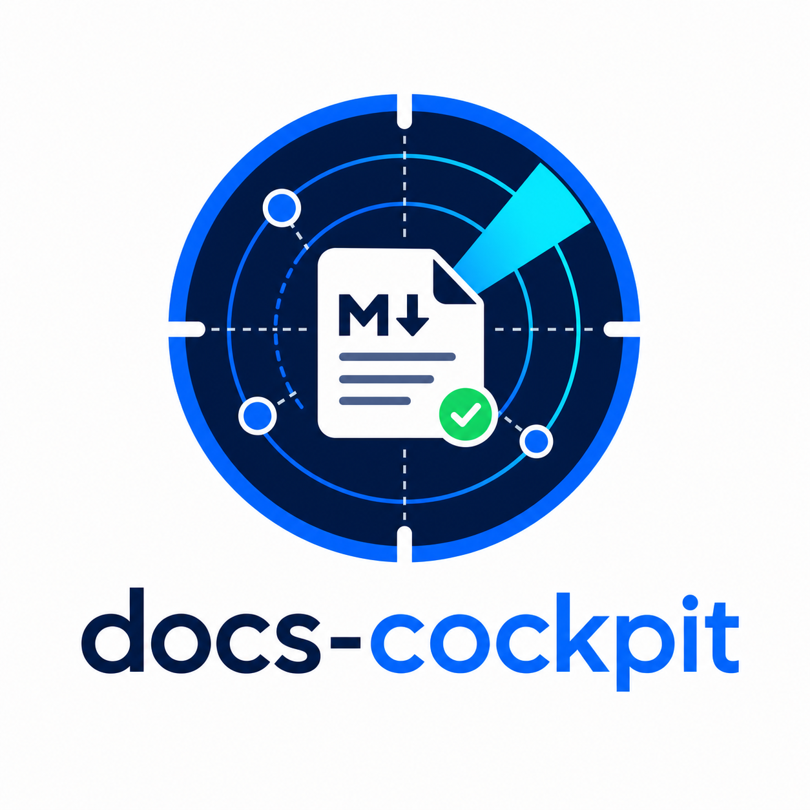
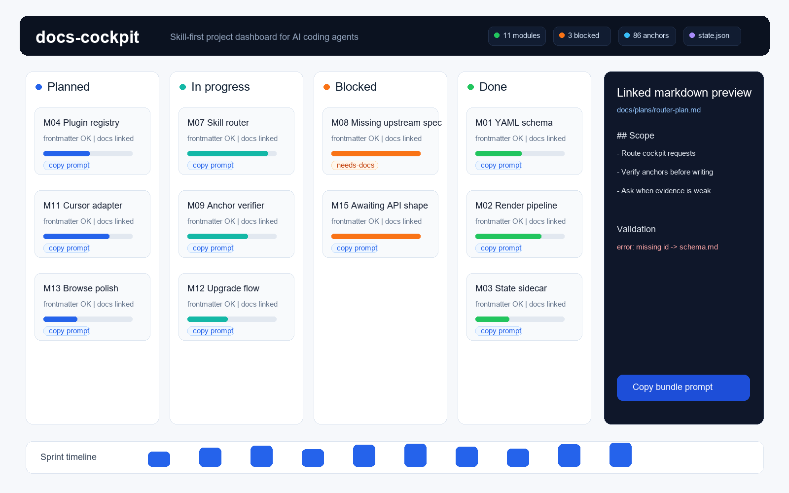
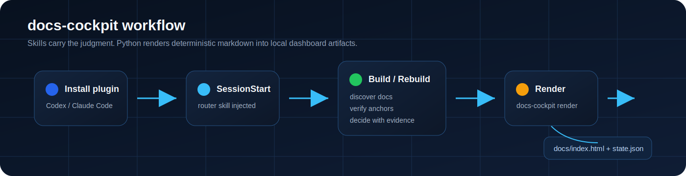

# docs-cockpit

<p align="center">
  
</p>

> 面向 AI coding agents 的 skill-first 项目驾驶舱。把 AI 写下的 markdown 变成经过 schema 校验的单文件 dashboard。

[](LICENSE)
[](pyproject.toml)
[](CHANGELOG.md)
[](#contributing)


## Why docs-cockpit

AI coding 重度用户会产生大量有价值的项目 markdown：plan、spec、RFC、模块说明、subtask、状态总结。没有结构时，这些知识会变成一堆文件，下一次 agent 会话又要重新发现。

docs-cockpit 把这些 markdown 变成一个可操作的驾驶舱：

- 本地 Kanban dashboard，展示模块、概念、subtask、docs 和进度。
- validator 按唯一的 canonical schema 校验 frontmatter。
- `state.json` sidecar 让 agents 和 CI 不需要解析 HTML。
- skill layer 教 Codex、Claude Code 以及兼容 agents 如何和你一起构建、刷新 cockpit。

核心规则很简单：cognition lives in skills, Python only renders。agent 负责推理关联和 anchors；CLI 只把 markdown 确定性地 render 成 `docs/index.html` 和 `docs/state.json`。

## Quickstart

先把 plugin 装进你的 agent，再打开一个仓库，让它设置 docs-cockpit。任何带 `docs-cockpit.yaml` 的项目里，`SessionStart` hook 都会自动注入 router skill。

### Codex

```bash
codex plugin marketplace add Guohao1020/docs-cockpit
codex plugin add docs-cockpit@docs-cockpit
```

### Claude Code

```bash
/plugin marketplace add Guohao1020/docs-cockpit
/plugin install docs-cockpit@docs-cockpit
```

### CLI fallback

如果你只需要 renderer 和 validator：

```bash
pip install docs-cockpit
docs-cockpit init
docs-cockpit render -c docs-cockpit.yaml
```

用 `file://` 打开 `docs/index.html`。提交 frontmatter 改动前运行 `docs-cockpit lint`。

## See It





## How It Works

docs-cockpit 有三层：

1. 带 YAML frontmatter 的 markdown 文件描述 modules、concepts、plans、RFCs 和 linked docs。
2. Skills 引导 agent 完成 setup、association、drift diagnosis 和 status reading。
3. Python CLI 校验 schema，并 render 静态 artifacts。

`docs-cockpit render` 会写出：

- `docs/index.html` - 自包含 dashboard。
- `docs/state.json` - machine-readable payload 加 validation issues。
- `docs/prompts.js` - dashboard 复制 prompt 时使用的片段。

运行时不需要 server。

## Product Tour

- Module Kanban：状态列、KPI strip、progress、owner、dependencies 和 sprint grouping。
- Split-view drawer：description、status controls、subtasks、linked docs 和内联 markdown preview。
- Backlog view：跨模块 subtasks，支持 sprint、status、time 和 search filters。
- Concept grid 与 system docs drawer：展示 PRD、architecture notes、memory files 和 RFCs。
- Copy-prompt actions：可复制单个 subtask、选中的 bundle、缺失文档 scaffold。
- `docs-cockpit browse` 生成 tree-sidebar markdown reader。
- Frontmatter lint 输出 severity、suggested fix，并引用 `references/schema.md`。

## Skill Layer

plugin 发布三个 skills：

| Skill | Role |
|---|---|
| `use-docs-cockpit` | Entry router，在带 `docs-cockpit.yaml` 的项目里由 `SessionStart` 注入。 |
| `docs-cockpit-build` | First-build workflow：确保 config、发现 docs、推理 associations、验证 anchors、不确定时先问、起草缺失 docs、render。 |
| `docs-cockpit-rebuild` | Refresh workflow：读取当前 state、诊断 drift、重新推理 broken links、做 minimal diffs、render 并 verify。也会从 `state.json` 回答纯状态问题。 |

知识层在 `references/`：schema、association method、operations、config reference、design tokens 和 frontmatter conventions。

## State Sidecar

每次 render 都会在 dashboard 旁边写出 `docs/state.json`。它包含 UI 使用的同一份 payload，以及 validation 产生的结构化 `issues[]`。Agents 用它生成状态叙述，CI 可以用它做 strict validation，外部工具也能直接消费它，不需要解析 HTML。

sidecar schema 是 additive-only：可以增加字段，但不会随意移除已有字段。

## Philosophy

- Skill-first：agent judgment 应该写在可读的 skills 里，而不是藏在 CLI heuristics 里。
- A wrong anchor is worse than a missing anchor：build workflow 会验证证据，不确定就问，不猜。
- Single-file dashboard：用 `file://` 打开，可以提交进仓库，也可以不依赖 hosting 分享。
- Frontmatter as the database：人类可读的 markdown 仍然是 source of truth。
- One schema source：`references/schema.md` 是 validator 引用的 spec。
- Deterministic rendering：Python 只加载 config、校验 metadata、嵌入 linked docs、写 artifacts。

## Project Anatomy

```text
your-project/
├─ docs-cockpit.yaml
├─ docs/
│  ├─ index.html
│  ├─ state.json
│  ├─ browse.html
│  ├─ spec/
│  │  ├─ module/M01-*.md
│  │  └─ concept/C01-*.md
│  ├─ plans/YYYY-MM-DD-<id>-plan.md
│  ├─ RFC/001-*.md
│  └─ PRD.md
├─ AGENTS.md
└─ .git/
```

## Frontmatter Example

```yaml
---
id: M07
type: module
title: "Job / Task FSM"
status: in-progress
sprint: M1.2
progress: 60
desc: "Job lifecycle state machine that drives worker scheduling."
owner: harvey
docs:
  - title: "Execution plan"
    path: "docs/plans/2026-05-03-m07-fsm-plan.md"
depends_on: [M06]
blocks: [M08, M09]
subtasks:
  - title: "Wire FSM enum to Pydantic"
    done: true
  - title: "Worker pulls next state from queue"
    done: false
---

# Module notes
```

body 里的 checklist 也可以携带 anchors：

```markdown
- [ ] Implement retry transition @code:src/worker/fsm.py:42-89 @docs:docs/RFC/004.md#section-2
```

完整 frontmatter 和 anchor 规范见 [`references/schema.md`](references/schema.md)。

## Updating

直接让 agent 升级 docs-cockpit，或者运行：

```bash
docs-cockpit upgrade
```

upgrade flow 会检查 CLI 和 plugin 两层版本，展示相关 release notes；如果 skills 发生变化，会清理 plugin cache，并提示需要重启 Codex。

## Contributing

```bash
git clone https://github.com/Guohao1020/docs-cockpit
cd docs-cockpit
pip install -e .
py -3.13 -m pytest tests/ -q
docs-cockpit render -c docs_cockpit/examples/minimal.yaml --debug
```

修改 architecture、skills、schema、hooks 或 templates 前，请先读 [`AGENTS.md`](AGENTS.md)。Skill changes 都是 release events，因为缓存的 plugin descriptions 会影响 routing。

Bug fixes 和 docs improvements 可以直接提 PR。涉及 schema changes、new commands、workflow changes 或 breaking behavior 时，请先开 issue。

## Community

- Landing page: <https://guohao1020.github.io/docs-cockpit/>
- Issues: <https://github.com/Guohao1020/docs-cockpit/issues>
- Release notes: [CHANGELOG.md](CHANGELOG.md)
- Schema: [`references/schema.md`](references/schema.md)
- Skill-first pivot: [`docs/plans/P-skill-first-pivot.md`](docs/plans/P-skill-first-pivot.md)

## License

MIT。见 [LICENSE](LICENSE)。
